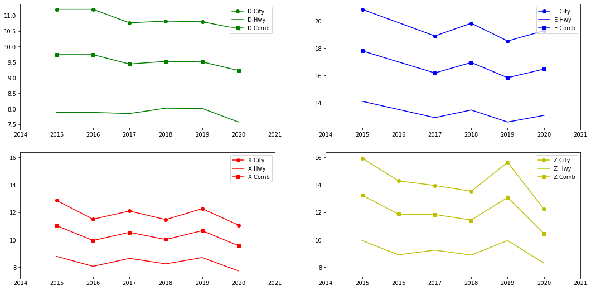

# EDA 

### Complicación

La primera, y mas condicionante, complicación que encontre en la realización de este trabajo fue la selección de un tema concreto. No terminaba de entender la finalidad del proyecto, imposibilitandome tener un proceso lógico-creativo adecuado para la resolución de este. Llevando a una horrible gestión del tiempo, lastrado por un continuo e irresoluble cambio de Dataset con el que trabajar.

### Proyecto

El proyecto consistió en dos análisis: 
- Un EDA con una conclusión clara y medible
- Un EDA inconcluso donde se priorizo el tratamiento de datos

#### Proyecto 1

Para este proyecto quise buscar respuesta a: ¿Los fabricantes de coches han logrado reducir el consumo de carburantes fósiles?

La información la obtuve de dos datasets distintos que a posteriori agrupe
- https://www.kaggle.com/datasets/debajyotipedder/co2-emission-by-vehicles Contiene el consumo de carburante de cada modelo de coche
- https://www.kaggle.com/datasets/nehalbirla/vehicle-dataset-from-cardekho Contiene los coches sacados por año 

Librerias utilizadas:
- Pandas
- Matplotlib

La conslusión fue acertada afortunadamente

	

Conclusion?
Entendi la finalidad, analizar informacion y encontrar patrones o segmentaciones de las que poder sacar una solucion 'predicitva' de lo que pasaría si tu intervinieras como uno mas dentro de esos datos
